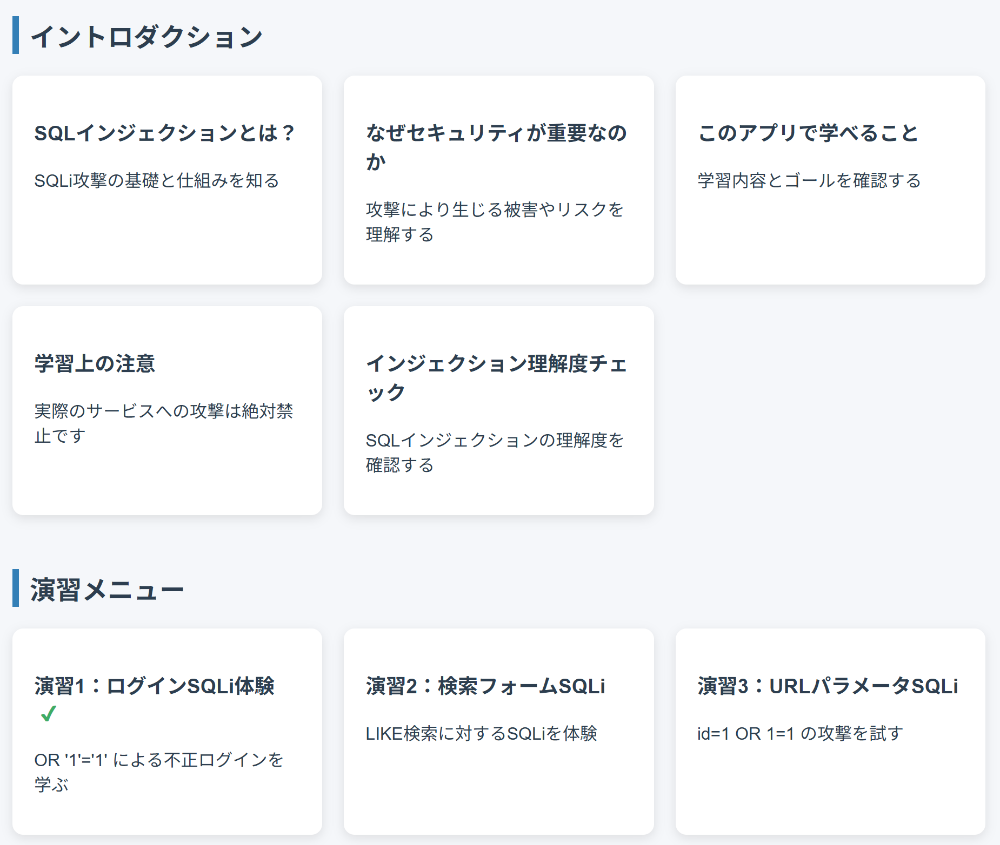
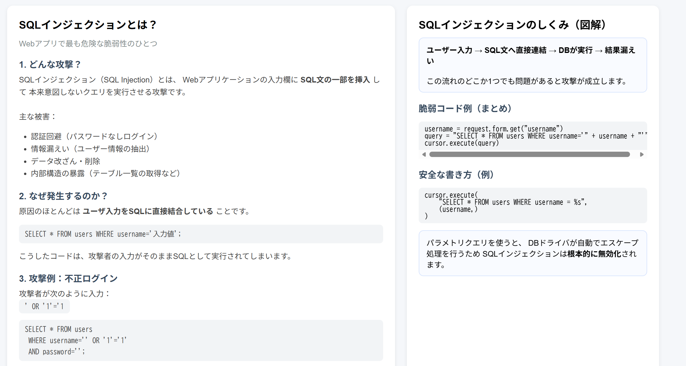
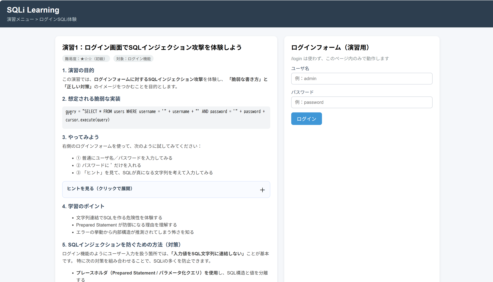
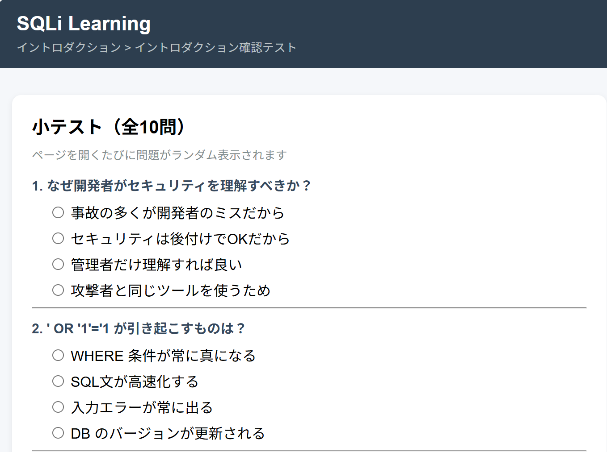

# SQL Injection Learning App

An educational web application designed for beginner web developers to **learn SQL Injection (SQLi) vulnerabilities and countermeasures through hands-on practice**.

This system provides an interactive environment where users can observe how SQL injection attacks occur and how secure coding techniques can prevent them.

The project was developed as part of a research effort on **web application security education**.

---

# Overview

SQL Injection is one of the most well-known vulnerabilities in web applications.  
It has been continuously listed as a major security risk in the **OWASP Top 10**.

Although many developers are aware of SQL injection, it is often difficult for beginners to fully understand the **attack mechanisms and defensive techniques** without practical experience.

This project provides a **safe and controlled learning environment** where users can experiment with vulnerable code and observe how attacks affect a web application.

The objectives of this system are:

- Understand how SQL injection attacks work
- Learn by attacking intentionally vulnerable code
- Understand secure implementation techniques
- Support security education for web developers

---

# Background

Web applications are widely used as fundamental information systems in many areas of modern society, including business, government, and healthcare. As web-based services continue to expand, the importance of web application security has also increased.

Among various threats targeting web applications, **SQL Injection (SQLi)** remains one of the most critical and persistent vulnerabilities. SQL injection occurs when user input is improperly handled and directly incorporated into SQL queries, allowing attackers to manipulate database operations. Such attacks may lead to serious security incidents such as data leakage, data tampering, and service disruption.

Despite being a well-known vulnerability, SQL injection continues to appear in many web applications due to factors such as legacy code, insufficient security knowledge among developers, and development processes that prioritize speed over security.

In recent years, the spread of AI-assisted development tools has made it easier for individuals and small organizations to build web applications. While this accelerates development, it also increases the risk that applications may be created and deployed without sufficient consideration of security.

Therefore, it is increasingly important for developers to understand not only how to build web applications, but also how to implement them securely and prevent vulnerabilities such as SQL injection.

---

# System Architecture

Client (Browser)

↓

Frontend  
HTML / CSS 

↓

Backend  
Python Flask Application

↓

Database  
SQLite / PostgreSQL

---

# Learning Modules

The application contains several learning modules that gradually introduce SQL injection concepts.

## Introduction

- What is SQL Injection?
- Importance of web security
- What you will learn in this application
- Learning precautions

## Practice Exercises

- Login SQL Injection
- Search-based SQL Injection
- URL parameter SQL Injection
- Error-based SQL Injection
- Blind SQL Injection
- Static analysis of vulnerable code
- Dynamic analysis demonstration
- Secure SQL implementation (defense version)

## Quiz

- Introduction comprehension quiz
- Practice exercise review quiz

---

# Screenshots

### home



### introduction SQLi



### Exercise 1



### introduction quiz



---

# Technology Stack

## Backend

- Python
- Flask
- SQLAlchemy

## Database

- SQLite (development)
- PostgreSQL (production)

## Frontend

- HTML
- CSS

## Development Tools

- Git
- GitHub
- VSCode

---

# Project Structure

```
SQLI_LEARNING_APP
│
├ docs
│   ├ exercise1.png
│   ├ home.png
│   ├ intro_quiz.png
│   └ intro_sqli.png
│
├ instance
├ migrations
├ templates
│
├ README.md
├ README_JP.md
└ app.py
```

---

# Security Disclaimer

This application intentionally includes vulnerable code for **educational purposes only**.

Do not deploy this application in a production environment.

---

# Author

Masato Hirayama
 
College Student, Okayama University

---